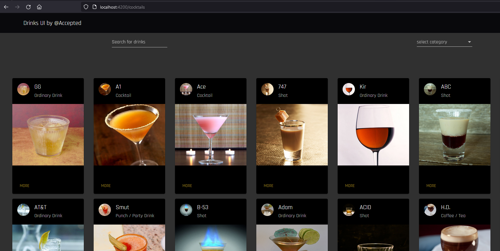
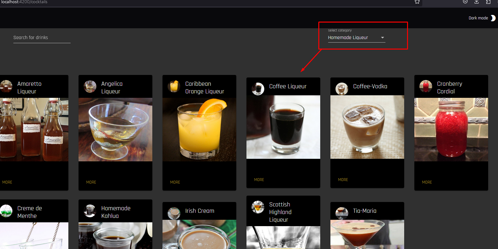
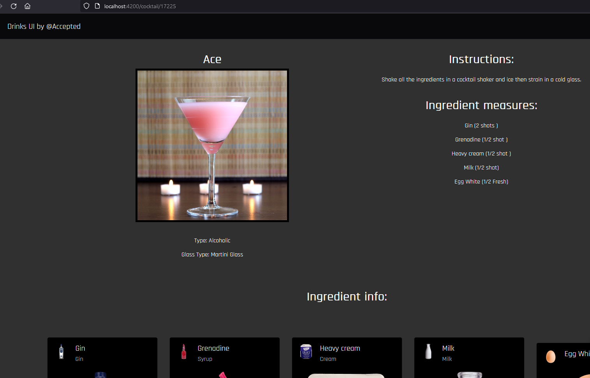
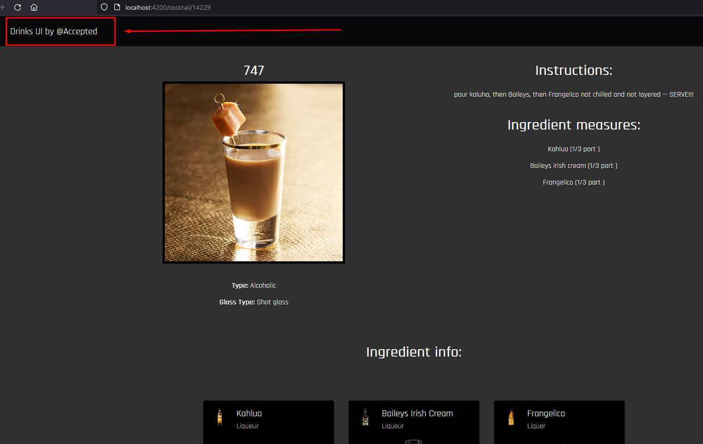
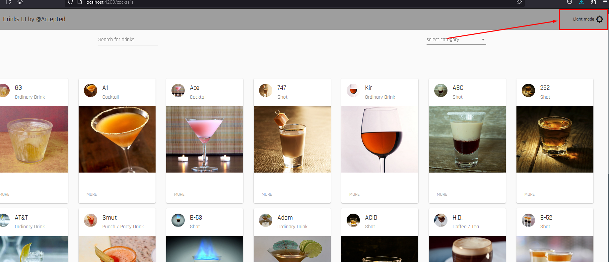
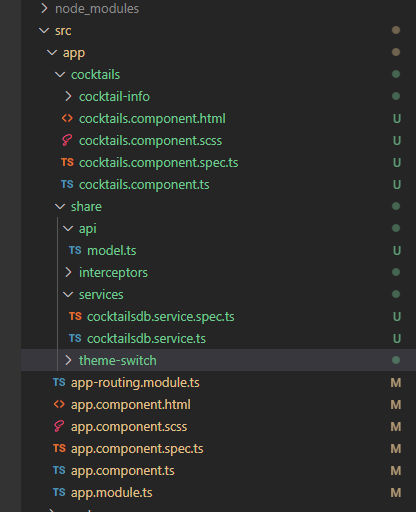

# AcceptedCoctails

This project was generated with [Angular CLI](https://github.com/angular/angular-cli) version 13.1.2.

## Development server

Run `ng serve` for a dev server. Navigate to `http://localhost:4200/`. The app will automatically reload if you change any of the source files.

## Overview 

This is a demo project.
I have choosen the cocktails DB as the external 3d party api.

These are the main requirements
 UI should be able to support:
- See all items from the API on the main page
- Search for items using an input field
- Filter items by category
- Click on an item to see more detailed information on a separate page
- Toggle the color scheme between light and dark mode
- Maintain the state of the color scheme after refreshing the browser

## Solution 

### 1. See all items from the API on the main page 

The api does not allow to query all items. This is reasonable for a third party API. However, searching drinks with an empty string returns 25 drinks randomly. 

These are displayed within the landing page:

### 2. Search for items using an input field

I have choosen to utilize a `formControlName` and subscribe a value change event to it, in order to execute the search. Consider that I have also piped a 1000 ms debounce time. So, the user can write down the search filter but the request will be sent to the server once the user stops typing for 1 second.

### 3.  Filter items by category
In a same manner, as 2, I use a `formControlName` to filter items by category. Debounce time was not neccessary this time. Eevry time the user selects a category, the  drinks belonging to this category are displayed. 

### 4. Click on an item to see more detailed information on a separate page

I use the routing module to navigate to the "drink info page" whenever you click on an item. This page also diplays the ingredients of the selected drink. The "cocktail-info" page accepts the drinkId as an argument of ActivatedRoute. 

If you want to move back, click on the logo on topbar:

### 5. Toggle the color scheme between light and dark mode

I have utilised a sharing component along with a service holding the choosen mode (dark /light). 

### 6. Maintain the state of the color scheme after refreshing the browser

To do so I have choosen to store a boolean attiribute called "isDarkTheme" in the local storage of the client (web browser).  If user choses dark theme, then this value should be `true` if not should be `false`. So, whenever someone returns to the page the app will try to find and apply the value of this parameter. 

## Code Architecture

I have used the reactive pattern in all aspects of the solution. This means that all the ui elements are dependand on TS objects, entities, arrays, etc..... I could also use the state managemnt (NgRx) for this task, however, concerning the time limits to complete the task, I though it would be more wise to spend some time for the appearence of the app. 

`cocktails` folder holds the components of this demo. One for displaying all cocktails with search capabilities and one more displaying the selected cocktail with various details. 

`share` folder contains the `api` ts file which in turn conatins all the interfaces used (mainly) for data reading.  It also contains an `error interceptor` which collects all possible errors form http requests. This way, developers dont need to worry about any errors when subscribing an Observable. I also inlude a `service` file which handles all the API requests

`theme-switch` is a sharable component and can be used in any part of the app. To achive the dark and ligh style I  have defined these two themes into root `styles.css` as `$light-theme` and `$dark-theme`

## Testing & linting the app

Run `ng lint` to check for any lint errors 

Run `ng test` to run the unit tests. 

